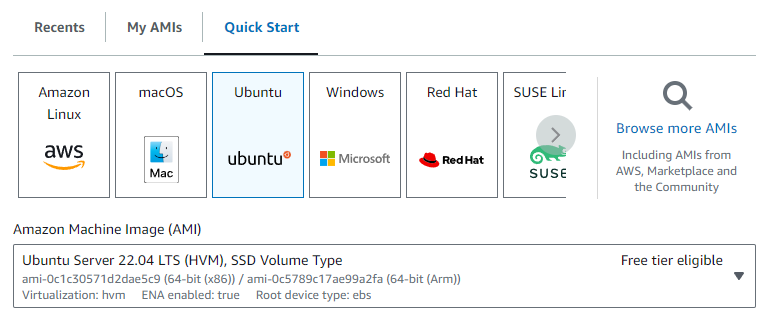
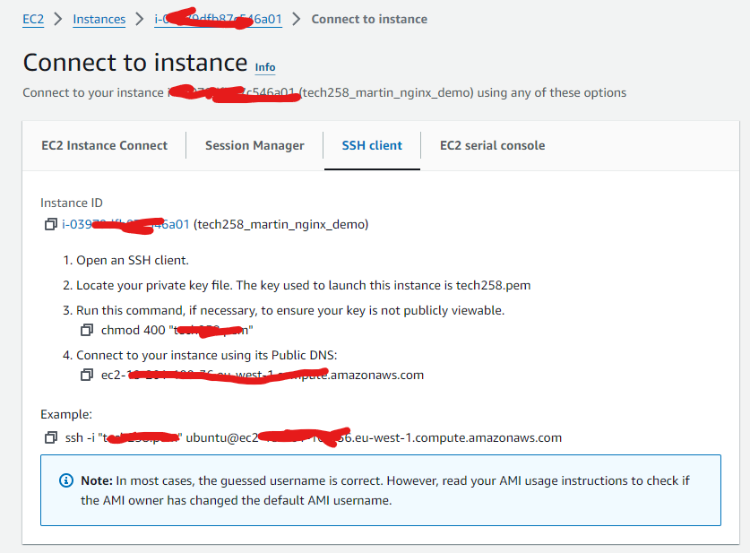

# How to Deploy nginx on an EC2 instance on AWS

## Part 1 Creating an EC2 instance on AWS
1. Access the AWS console and locate the EC2 service. You can find EC2 using the following options: 
 
 
 
2. Launch an instance. 

3. Provide a name for your instance.  

4. Choose your Amazon Machine Image (AMI). 

   * What is a Machine Image?
     * A machine image is a copy of a virtual machine's configuration, including the operating system, installed software, and any configurations made to the system.
5. Select the instance type that suits your requirements. 

6. If you have a pre-made key pair, select it. Otherwise, create a new one and store the private key in your .ssh folder. 

   * What are SSH keys and how we are using them here?
     * SSH Keys are a pair of cryptographic keys used for secure communication between a client and a server over an insecure network like the internet.
     * In this case we are using the SSH keys as a method of securely accessing our EC2 ubuntu instance. We have the key and the EC2 instance is locked, we must unlock it to access it.
7. Configure security settings to allow SSH traffic on port 22 and HTTP traffic on port 80. 

   * What are security groups?
     * Security Groups in AWS are virtual firewalls that control inbound and outbound traffic.
   * What are ports?
     * Ports are communication endpoints that allow different services or applications to connect and exchange data over a network.
     * Each port number corresponds to a specific service or protocol, allowing for efficient and secure data transfer over networks. SSH uses port 22, and HTTP uses port 80. If you were using HTTPS it would be port 433.
8. Launch your EC2 instance. 

9. Open a bash terminal (e.g., GitBash) and navigate to your .ssh folder. 
10. Follow the instructions to connect via an SSH client. 

11. Upon executing the final command from step 10, press Enter to establish an SSH connection for the first time. 
 

**Congratulations!** You have now created an EC2 instance on AWS.

## Part 2 Deploying nginx on your EC2 instance
1. After completing the steps in Part 1, you should see a screen similar to the following: 

This is your ubuntu VM running on your EC2 instance. 
2. Enter the following commands to update and install the updates of the necessary ubuntu packages. 
   * `sudo apt update -y` 
   * `sudo apt upgrade -y` 
   * If you encounter any pink windows, press enter twice. 
     * These commands contain `-y` to preemptively confirm that the user wants to do the command that they are entering. This is particularly useful when you are automating bash processes.
3. Install nginx using this command: 
   * `sudo apt  install nginx -y` 
   * If prompted with any dialogs, press Enter as needed.
     * What is nginx?
       * nginx is a popular open source web server. It is incredibly scalable and that is why it interfaces well with an AWS EC2 instance. It can be used to host websites, applications, and APIs.
4. Once nginx is installed, it will automatically begin running. To confirm this enter this command:  
   * `systemctl status nginx`
   * This command should show something similar to the following image:  
   
5. **Congratulations!** You have now deployed nginx on your EC2 instance. To confirm everything is okay, enter your EC2 instances public IP address into a web browser to see what is being hosted on your VM. 
