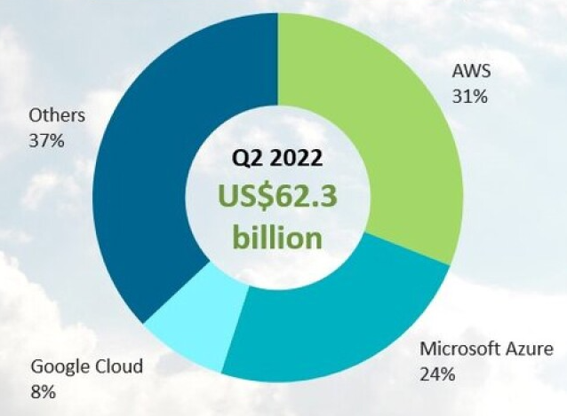

## What is cloud computing?
Cloud computing is like renting a computer over the internet. Instead of owning and maintaining your own physical servers or computers, you can use resources (like storage, processing power, or software) provided by a cloud service provider.
## How do we know if something is in the cloud?
If you access services or store data online without needing physical hardware, it's likely in the cloud.

### What is the difference between on-prem and the cloud?
* On-premises - Managing and maintaining your own servers locally.
* Cloud - Using resources provided by a cloud service provider over the internet.
## The 4 deployment models of cloud.
### Private
Dedicated cloud infrastructure for a single organisation.
### Public
Services available to everyone on the internet.
### Hybrid
Combination of private and public cloud services.
### Multi-Cloud
Using services from multiple cloud providers.

## Types of Cloud Services
### IaaS - Infrastructure as a service
- Virtualized computing resources.
- Rent virtual servers, storage, and network infrastructure.
- Allows scalability and flexibility in managing resources.
### PaaS - Platform as a service
- Platform for developing applications.
- Provides tools for app development, testing, and deployment.
- Developers focus on coding without worrying about underlying infrastructure.
### SaaS - Software as a service
- Software accessible online through a web browser.
- Users access applications without needing to install them locally.
- Updates and maintenance handled by the service provider.

## What are the advantages and disadvantages of Cloud? (In the context of a business)
### Advantages
* Scalability
* Cost-effectiveness.
### Disadvantages
* Security risks
* Downtime.

## OpEx vs CapEx
* OpEx (Operating Expenses): Ongoing costs like cloud subscriptions.
* CapEx (Capital Expenditures): Upfront costs like buying servers.

### How do they relate to the cloud?
Cloud services are often OpEx due to recurring payments.

## Is moving to the cloud always cheaper?
Moving to the cloud can be cost-effective but varies based on usage and management. For example, if servers are left on unnecessarily then extra money will be spent.

## Market share of the Cloud - What is the breakdown?

## What are the 3 largest Cloud providers known for?
* AWS
  * Broad service offerings.
* Azure
  * Integration with Microsoft products.
* Google Cloud
  * Strong in data analytics and AI.
### What makes them popular?
* Reliability
* Scalability
* Global presence

## Which cloud provider do I think might be the best and why?
I think that AWS is the best due to having such a broad catalog of services on offer. Additionally, they are the most popular so there is the most discussion between users on how to use AWS effectively.
## What sorts of things do you usually need to pay for when using the cloud?
* Data storage
* Computing resources
* Network usage.
## What are the 4 pillars of DevOps? How do they link into the Cloud?
* Collaboration 
In DevOps, collaboration means teams working together smoothly to create and deliver software. When it comes to the cloud, it's like using shared tools and resources effectively with everyone on the same page.

* Automation 
DevOps uses tools to make repetitive tasks easier, like testing and deploying software. In the cloud, automation helps manage tasks like scaling resources and setting up services, this makes everything run more smoothly.

* Integration 
DevOps is all about making sure different parts of software fit together well. In the cloud, it's about connecting different services and apps so that they work seamlessly.

* Feedback 
Just like getting advice to improve your skills, DevOps uses feedback to make processes better. In the cloud, feedback helps in monitoring performance, understanding usage patterns, and making cloud services work even better.
